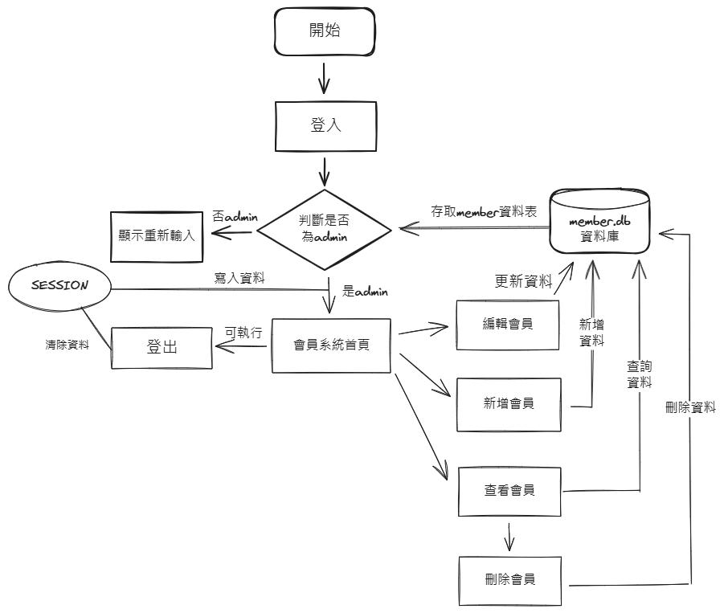
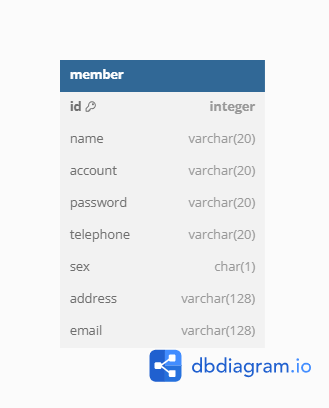

# UM-Practice-Project

會員系統

## 目錄
- [專案介紹](#專案介紹)
- [功能特性](#功能特性)
- [系統需求](#系統需求)
- [安裝步驟](#安裝步驟)
- [配置環境](#配置環境)
- [如何使用](#如何使用)
- [流程圖](#流程圖)
- [ER圖](#ER圖)

## 專案介紹
用戶登入管理者帳號，操作會員系統

## 功能特性
- 新增、修改、刪除、查詢


## 系統需求
- PHP 8.2.12
- SQLite3 
- Composer
- Apache

## 安裝步驟
1.  git clone project

2.  composer install

## 配置環境
1. 確保 `mod_rewrite` 已加載 (Apache 的`httpd.conf`)
    ```plaintext
   LoadModule rewrite_module modules/mod_rewrite.so
    ```

## 如何使用?
1. 登入管理者帳號:admin、密碼:1234

2. 操作會員系統

## 流程圖


## ER圖
